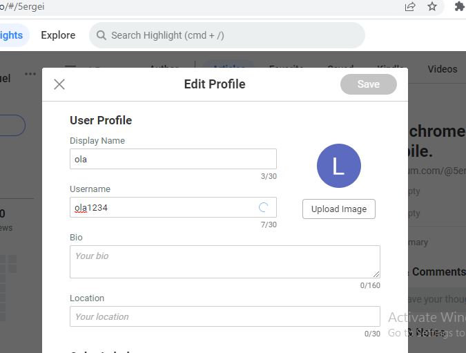

# __Glasp: A User Guide__ 
## Table Of contents
1. [Introduction](#introduction)
2. [what Is Glasp?](#what-is-glasp)
3. [Why Glasp?](#why-glasp)
4. [Key Feautures Of Glasp](#key-feautures)
5. [Getting Started With Glasp](#getting-started-with-glasp) 
    [Signing Up On Glasp](#signing-up-on-glasp) [Installing The Glasp Extension](#installing-the-glasp-extension)  [Setting Your Account](#setting-up-your-account)

6. [How To Use Glasp](#how-to-use-glasp) 
[Highlighting Texts](#highlighting-texts) 
[Generating AI Summary](#how-to-generate-an-ai-summary) 
[Adding Tags](#adding-tags) 
[Sharing](#sharing) 
[Glasp On Youtube](#glasp-on-youtube)
6. [Conclusion](#conclusion)

## **Introduction**
Note-taking is the process of collecting and writing down points of information, for research and learning purposes. This process, however, can be time-consuming and lack proper organization when it isn't done correctly, especially when using traditional means like Pen and Paper or Typewriter to take notes. 
A lot of tools have been developed, to provide solutions to these
[problems associated with traditional note-taking methods.](https://bismarckstate.edu/uploads/resources/2628/types-of-notes-handout.pdf) Glasp however, has been the stand-out among others.

In this guide, you will learn about Glasp, and at the end of this guide, you will be able to start using this web highlighting tool.
    
## __What is Glasp?__

    
 Glasp, [an acronym for Greatest Legacy Accumulated As Shared Proof,](https://glasp.co/about#:~:text=As%20Glasp%20stands%20for%20%22Greatest,contribution%20to%20human%20knowledge%20history.) is a social web highlighting tool that allows you to highlight important points, quotes, and ideas, while reading an article, blog or a newsletter on the web, without having to leave the webpage. The highlighted content is added to your Glasp homepage automatically and can be shared with your friends and like-minds on Glasp or other social platforms. 
    Glasp also lets you summarize youtube videos using Artificial intelligence(AI), The summmary which is provided in a text format helps users to understand the key points in the video.
## __Why Glasp?__ 
Glasp, a free-to-use browser extension has made note-taking a lot better, as it encourages highlighting and taking points without breaking your reading flow. 

Here are some benefits of using Glasp:

- __Idea sharing:__ Glasp encourages sharing ideas and thoughts among like minds, you can see what fellow like-minded people have shared regarding a topic you are researching and build on it, and this makes research and learning better.
- __Organisation:__ Highlighted notes are stored on your Glasp page, which can be easily accessed when you need them.
- __Time management:__ You can read an article, take important notes, and save them, without leaving the reading page, this makes research and learning a lot quicker.
- Glasp also brings you articles based on topics you follow to help you stay enlightened.

## __Key Feautures__
Glasp is a great tool to use, not just for research and learning purposes, it is also useful for social interactions. 
Glasp updates its features to keep improving constantly, 
Here are some of Its latest features:
* __Highlighting:__  Glasp lets you highlight key texts and phrases in articles and videos.

* __Summarization:__ Glasp generates a summary of youtube videos using AI, The summarized text is displayed in a separate panel, with the video playing next to it. your highlighted texts can also be summarized.

* __Language Support:__ Glasp provides support for multiple languages, which includes English, French, Italian, Portuguese, Spanish, and Deutsch.
* __Customization:__ You can choose to get either a brief overview of a video or a deep and more detailed summary. This can be done by modifying the level of detail in the summarization settings 
* __Tagging:__ Glasp lets you tag your highlights, tags makes it easier for other like-minds to find articles relating to a topic.

* __Interaction:__ Glasp lets you connect with others by sharing your highlighted thoughts on your Glasp page, via emails, and other social messaging platforms.

## __Getting Started With Glasp__
Glasp is quite clear to use, you have to create an account, then download the extension to be use this tool. Follow these steps to get started:
1. ###  __Signing up On Glasp__
These are the steps to sign-up on Glasp

 **Step 1**

Go to your browser, in the address bar, type in [https://glasp.co](https://glasp.co), Click the Sign up(Beta) button to continue.

 **Step 2**

click on the "Continue with Google" button to complete the sign-up process

 **Step 3**

Check your mail to verify your account, and  complete the sign-up process.

2. ###  __Installing The Glasp Extension__
After you have completed the sign-up process, you will be redirected to the Chrome web store to install the Glasp extension

 **Step 1**

 click the add to Chrome button, and wait for your download to be completed

 **Step 2**

click the pin icon to add the Glasp extension to your google chrome toolbar

3. ### __Setting Up Your Account__
You have completed the installation, Follow these steps to set-up your Glasp account

**Step 1**

Choose your favorite topics on the Glasp homepage, You can choose up to 10 topics.

 **step 2**

Edit your profile. Input your Name, Bio, Choose a Username and add the links to your social media accounts.

## __How to use glasp__

1. #### **Highlighting texts**

Highlighting a text is quite straightforward, 

I. Select the text or point, you would like to highlight. 
II. Choose a color for the highlighted text.
  The text you highlighted will be added to your glasp page instantly,  

2. #### **How to generate an AI summary**

Follow these steps to create an AI summary of your highlighted text:  
I. Click on the glasp extension icon, to view the text  
II. click on "view AI summary"

3. #### **Adding Tags**

Tags are important because it helps like-minds find useful articles and thoughts.
 To add tags to your highlights, click on the "Tag Icon", and add a tag that matches the highlighted text.

You can delete a tag and also have multiple tags on your highlighted text. 
I. To delete a tag, use the "x" icon.  
II. To create more tags use the "tag" icon next to the previously made tag.

4. #### **Sharing**
I. Click on the "sharing icon" 
II. Choose the channel you want to share your highlighted texts.

5. #### **Glasp on youtube**

You can highlight, and summarize videos on youtube with Glasp. This is helpful because it allows you to understand a video without watching it to the end, making the learning process quicker. 
 
 **Highlighting a video**

 I. Go to the Youtube video you want to highlight and locate the glasp tool on the sidebar.

 II. Click the dropdown button to display the video summary.

III. Select the text you want to highlight and choose a color for the highlighted text 

**Generating An AI Summary**

I. Click the AI summary icon, and you will be redirected to the OpenAi page.

ii. Your summary has been generated successfully. the summary can also be highlighted. 

**NOTE:** You must have an OpenAi account, to use this feature.
## **Conclusion** 
Glasp is a powerful web highlighting tool, that makes reading online more fun, and meaningful. Its unique features enable Glasp users to be more organized, and smarter in their research, and learning. If you frequently read articles online, Then Glasp is for you, With this guide you have all you need to get started.